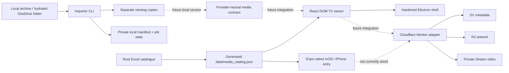

# Architecture

## System shape

Solid lines describe current runtime relationships. Dashed lines are implemented contracts or intended integrations, not a deployed end-to-end service.

## Two viewer implementations

`apps/tv/src/` is the feature-rich React DOM/Vite SPA. It provides studio ident, profiles and a
three-second profile gate, responsive generated catalogue rails, search, collections, a complete
Full Library view, details, profile-scoped progress/history, app-owned Stream HLS/direct-media player states with an interactive timeline, volume, fullscreen, and shared ten-second transport controls,
two-second ambient Home and one-second detail previews with policy-safe fallback, deterministic capture routes, keyboard spatial
navigation, and the renderer packaged by Electron. The same React DOM tree adapts at `<=800px`;
mobile cards route their primary tap directly to playback while retaining a separate Details action.

`apps/tv/App.tsx` is the Expo/React Native entry for two Apple targets. It dispatches on
`Platform.isTV`: tvOS builds render the smaller profile/home/player shell with
remote-aware focus, while phones render `apps/tv/mobile/MobileApp.tsx`. The phone branch provides
profile selection, Home, Search, Collections, Saved, catalogue details, and a bundled demo player.
The tvOS player uses the same ten-second interval around its focused Play/Pause control; the phone
player preserves native media controls and adds accessible ten-second transport buttons. Both
branches use explicit local screen state.

The tvOS shell, phone branch, and rich viewer share catalogue/types/helper packages and visual
intent, but not complete components or navigation state. React Native Web `0.21.2` renders the
phone branch for its Expo web/Safari preview; the rich Vite viewer renders with React DOM directly.
A Safari pass is web evidence, not native iOS evidence. No surface currently makes a feature-parity
claim, and native parity must be implemented and tested explicitly.

Neither Expo Router nor React Navigation is installed. Both viewers use small explicit screen-state machines. Expo documents React Navigation as tvOS-compatible, so it remains a reasonable future choice if native flow complexity warrants it.

`apps/tv/app.config.ts` selects its Apple target from `EXPO_TV`: `1`/`true` enables the tvOS plugin
target and landscape orientation; other values select the iPhone target and default orientation.
The root `tv:prebuild` and workspace `tvos` scripts explicitly select tvOS. `mobile:prebuild`,
`ios:mobile`, and both mobile development scripts explicitly select iPhone. Clean iOS prebuild
output must be regenerated when switching targets. The shared React Native TV fork and config plugin
are retained only for tvOS, and native application targets are limited to iPhone and tvOS.

## Application and package boundaries

| Area                     | Responsibility                                             | Persistence/network now                    |
| ------------------------ | ---------------------------------------------------------- | ------------------------------------------ |
| `packages/types`         | Zod-backed catalogue models                                | None                                       |
| `packages/catalog`       | Generated JSON validation/adaptation, profiles, rails      | Reads the committed generated JSON         |
| `packages/shared`        | Progress/player/pairing helpers                            | Renderer callers persist locally           |
| `packages/navigation`    | Geometry-based web focus selection                         | DOM only                                   |
| `packages/design-system` | Semantic colour, motion, and TV-safe-area constants        | Renderers currently mirror values manually |
| `packages/media`         | Mock, local, and Cloudflare Stream provider contracts      | Adapters only                              |
| `tools/video-importer`   | Real filesystem scan, manifest, conversion, resume, verify | Local files only                           |
| `services/api`           | Authenticated Worker routes and Cloudflare bindings        | Tested/dry-run only; not deployed          |

## Data and trust boundaries

- Source media is immutable input. The importer requires a distinct output root and writes `.partial` derivatives before atomic promotion.
- Manifests contain private absolute paths and stay local/ignored. They are not catalogue payloads for a browser.
- Viewer bundles receive provider-neutral URLs, never Cloudflare account credentials or signing material.
- Production-shaped device tokens are hashed in D1; Stream playback uses short-lived signed HLS generated server-side.
- Electron has no preload or IPC bridge. Packaged launches authenticate through the protected web canonical origin in Electron's persistent cookie session before switching to the local shared renderer; both a successful protected response and a non-expired Access cookie are required. Focus and five-minute checks return expired sessions to that same gate, and verification failures use a script-free local retry surface without exposing the archive. Navigation is restricted to that origin, its learned Cloudflare Access team host, the gated local renderer/error page, and narrowly allowlisted Stream frames. Windows, downloads, webviews, device permissions, and unrelated permissions remain denied.

The editable catalogue source is `media_catalog_populated.xlsx`. Generation produces the committed
`data/media_catalog.json`; content preparation always copies that JSON into ignored web runtime
output and copies approved local artwork only when the optional root `artwork/` directory exists.
Cloudflare builds therefore do not depend on ignored local artwork: the browser requests the Movies
API first and uses the committed JSON only as its development/offline fallback. The web catalogue
places API records with binary `priority=1` before records with `priority=0`, preserving source order
within each tier; category shelves inherit that order. Binary `featured` controls Currently Trending,
and binary `available` controls card interactivity. Legacy generated JSON remains in numeric ID order
when those API-only controls are absent. Runtime is nullable because the workbook has no authoritative
duration column; actual HTML media metadata can drive player timing and locally persisted progress,
but the catalogue adapter never invents a universal length.

## Build and generated artifacts

Expo Continuous Native Generation treats `apps/tv/ios/` as disposable, target-specific output of
`app.config.ts`; it is ignored. Web builds land in each app's `dist/`.
Electron installers land in `apps/desktop/release/`. Playwright artifacts and importer state are
ignored. Screenshot capture is the deliberate exception: it writes synthetic review images to the
repository-root `assets/lelibrambas-plus/screenshots/`.

The Vite public surface also contains a project-owned PNG cinema favicon family, Safari saved-app
icon, and web app manifest. These are static presentation assets only;
they do not alter native Expo icon generation or provision an install target.

See [iPhone development](README_IPHONE.md), [ADR 0001](docs/decisions/0001-tv-stack.md),
[ADR 0002](docs/decisions/0002-private-media-pipeline.md), [Security](SECURITY.md), and
[Cloud hosting](CLOUD_HOSTING.md).
