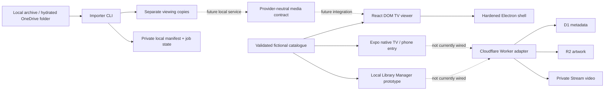

# Architecture

## System shape

Solid lines describe current runtime relationships. Dashed lines are implemented contracts or intended integrations, not a deployed end-to-end service.

## Two viewer implementations

`apps/tv/src/` is the feature-rich React DOM/Vite SPA. It provides studio ident, profiles, home rails, discovery views, search, details, local watchlists/progress, player states, synthetic playback, deterministic capture routes, keyboard spatial navigation, and the renderer packaged by Electron.

`apps/tv/App.tsx` is the Expo/React Native entry for two native targets. It dispatches on
`Platform.isTV`: television builds render the smaller profile/home/player TV shell with
remote-aware focus, while phones render `apps/tv/mobile/MobileApp.tsx`. The phone branch provides
profile selection, Home, Search, Collections, Saved, catalogue details, and a bundled demo player.
Both branches use explicit local screen state.

The TV shell, phone branch, and rich viewer share catalogue/types/helper packages and visual
intent, but not complete components or navigation state. React Native Web `0.21.2` renders the
phone branch for its Expo web/Safari preview; the rich Vite viewer renders with React DOM directly.
A Safari pass is web evidence, not native iOS evidence. No surface currently makes a feature-parity
claim, and native parity must be implemented and tested explicitly.

Neither Expo Router nor React Navigation is installed. Both viewers use small explicit screen-state machines. Expo documents React Navigation as TV-compatible, so it remains a reasonable future choice if native flow complexity warrants it.

`apps/tv/app.config.ts` selects its native target from `EXPO_TV`: `1`/`true` enables the TV plugin
target and landscape orientation; other values select the phone target and default orientation.
The root `tv:prebuild` and `android:tv` scripts explicitly set the TV target through their workspace
scripts. `mobile:prebuild`, `ios:mobile`, and both mobile development scripts explicitly select the
phone target. Clean prebuild output must be regenerated when switching targets.

## Application and package boundaries

| Area                     | Responsibility                                               | Persistence/network now                    |
| ------------------------ | ------------------------------------------------------------ | ------------------------------------------ |
| `packages/types`         | Zod-backed catalogue models                                  | None                                       |
| `packages/catalog`       | Deterministic 28-title seed, profiles, rails, people, places | None                                       |
| `packages/shared`        | Progress/player/pairing helpers                              | Renderer callers persist locally           |
| `packages/navigation`    | Geometry-based web focus selection                           | DOM only                                   |
| `packages/design-system` | Semantic colour, motion, and TV-safe-area constants          | Renderers currently mirror values manually |
| `packages/media`         | Mock, local, and Cloudflare Stream provider contracts        | Adapters only                              |
| `apps/admin`             | Catalogue/import/device/settings management UI prototype     | Browser `localStorage`; no CLI/cloud calls |
| `tools/video-importer`   | Real filesystem scan, manifest, conversion, resume, verify   | Local files only                           |
| `services/api`           | Authenticated Worker routes and Cloudflare bindings          | Tested/dry-run only; not deployed          |

## Data and trust boundaries

- Source media is immutable input. The importer requires a distinct output root and writes `.partial` derivatives before atomic promotion.
- Manifests contain private absolute paths and stay local/ignored. They are not catalogue payloads for a browser.
- Viewer bundles receive provider-neutral URLs, never Cloudflare account credentials or signing material.
- The demo Library Manager's local state is useful for interaction design, not multi-user authorization or durable production storage.
- Production-shaped device tokens are hashed in D1; Stream playback uses short-lived signed HLS generated server-side.
- Electron has no preload or IPC bridge and denies navigation, windows, downloads, webviews, and permissions.

## Build and generated artifacts

Expo Continuous Native Generation treats `apps/tv/android/` and `apps/tv/ios/` as disposable,
target-specific outputs of `app.config.ts`; both are ignored. Web builds land in each app's `dist/`.
Electron installers land in `apps/desktop/release/`. Playwright artifacts and importer state are
ignored. Screenshot capture is the deliberate exception: it writes synthetic review images to the
repository-root `assets/lelibrambas-plus/screenshots/`.

See [iPhone development](README_IPHONE.md), [ADR 0001](docs/decisions/0001-tv-stack.md),
[ADR 0002](docs/decisions/0002-private-media-pipeline.md), [Security](SECURITY.md), and
[Cloud hosting](CLOUD_HOSTING.md).
